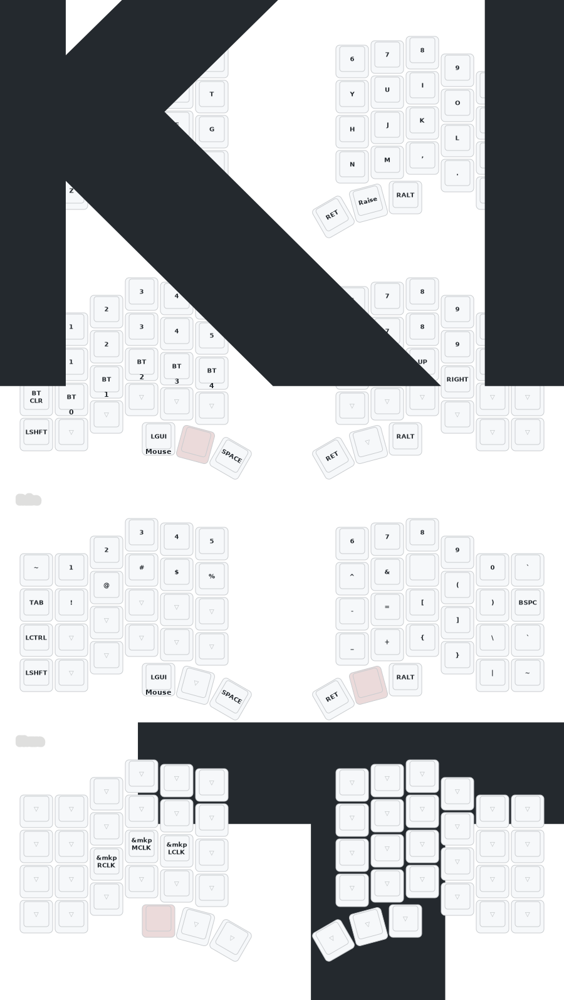

# Levels54 - Built for precision. Designed for control.

Levels54 is for people who care about how things are made and how they feel. Every component—from ceramic trackball bearings to stainless switch plates—is chosen to deliver smooth, precise, durable performance.

### Dual Precision Trackballs

Each half of the keyboard features a 34 mm Perixx  trackball, mounted on Silicon Nitride G5 precision ceramic static bearings. The motion is exceptionally smooth and stable, with zero wobble and consistent control. A Nylon 11 carrier adds refined form and visual character.

### For Builders & Tinkerers

The keyboard offers a 54-key hot-swap MX layout so you can choose exactly how it types. Firmware is ZMK with Studio built in, allowing you to program and remap every key directly in your browser without flashing tools or command-line steps. Both halves include a VIK connector for expansion: add modules, experiment with sensors, or build your own custom interface.

### Materials That Matter

- 316 stainless switch plates provide rigidity and precision
- HT-PLA cases deliver dimensional stability and a soft textured finish
- DSA blank keycaps offer a clean and uniform feel
- Nylon 11 trackball carrier and power switches contribute to a solid look and durable build

Every material here is chosen with purpose and durability in mind.

### Available Builds

- Kit: For those who build it themselves
- Complete: Fully assembled, tested and ready to use
- Limited: The flagship version, featuring brass machined power switches a black walnut bottom and trackball carrier that adds natural warmth, weight, and presence

### A Tool Worth Using

Whether you’re coding, designing, or in the flow of work, it’s built to keep your hands aligned, your wrists relaxed, and your mind focused.

Control without compromise.

### Specifications

- 54 Key MX layout with hot swap sockets
- 34mm Perixx Trackballs
- VIK connector on both sides for extensibility
- G5 Precision Ceramic Static Trackball Bearings
- 316 Stainless Switch Plates
- DSA Profile Blank Keycaps
- HT-PLA Cases (Black walnut bottom on Endgame)
- Nylon 11 Trackball Carrier and power switches
- Brass Heat Set Inserts

### Default Firmware Keymap
